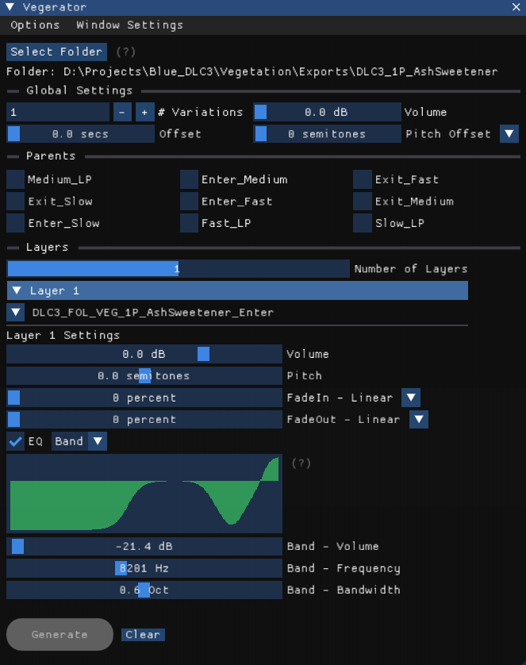
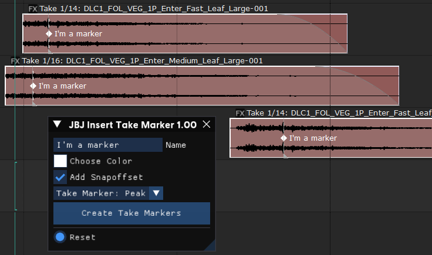

# Hey! Thanks for stopping by. 👋

This is just a little spot where I'm putting some REAPER scripts I've built.

I'm a big sound nerd and love tinkering with Lua to make tools that scratch an itch or just save me a few clicks. Basically, if I find myself doing something boring and repetitive, I try to build a script for it.

Feel free to poke around and check out the code!

---

## 🚀 My Scripts

Here's what I've got so far:

### 1. Vege-tator (The Foley Thing)

This was a big one! It's a tool I built to help create a *ton* of vegetation foley sounds (like leaves, grass, twigs) super fast. Instead of sitting there for an hour layering and randomizing, this script does the boring parts for you.

* **What it does:** You feed it some sounds, and it builds complex layers, messes with the pitch/volume/offset, and spits out a bunch of unique variations.
* **Coolest Part:** It has its own GUI and automatically creates all the new tracks and regions right in your REAPER session, all nice and tidy.
* **Where to find it:** All the code and a "how-to" guide are in the `vegerator/` folder.

### 2. Insert Marker at Peak

This one is simple, but it's a real time-saver.

* **What it does:** Just select an audio item (or a few), run the script, and *blip!*—it instantly drops a marker at the loudest point for each one.
* **I use it for:** Finding transients, dialogue peaks, or anything else similar for faster exporting times
* **File:** `JBJ_insert_marker_at_peak_for_selected_items.lua`

---

## 🛠️ The Guts

In case you're curious, everything here is just built with:

* **Lua** (for all the logic)
* **REAPER's API** (to make it all talk to the DAW)
* **ReaScript/GUI** (to build the little windows)
